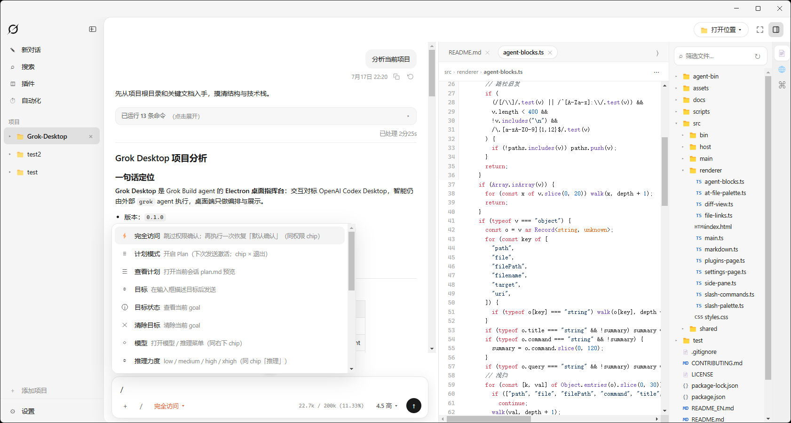
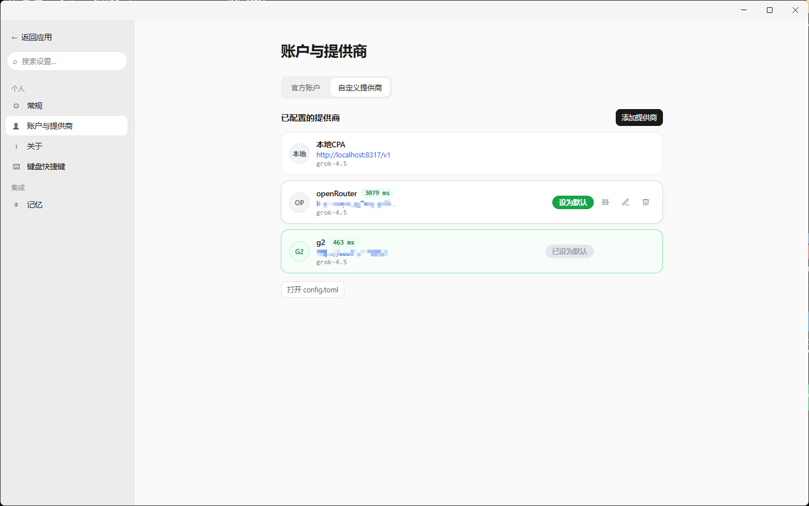
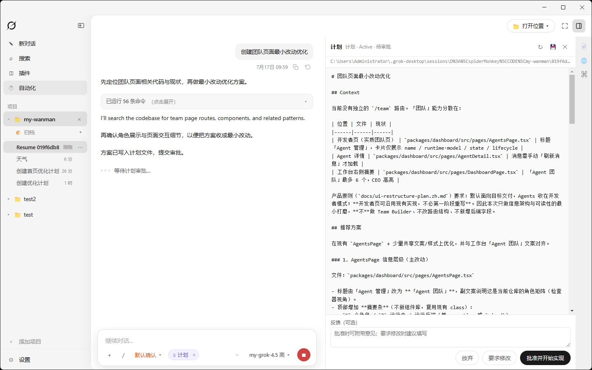
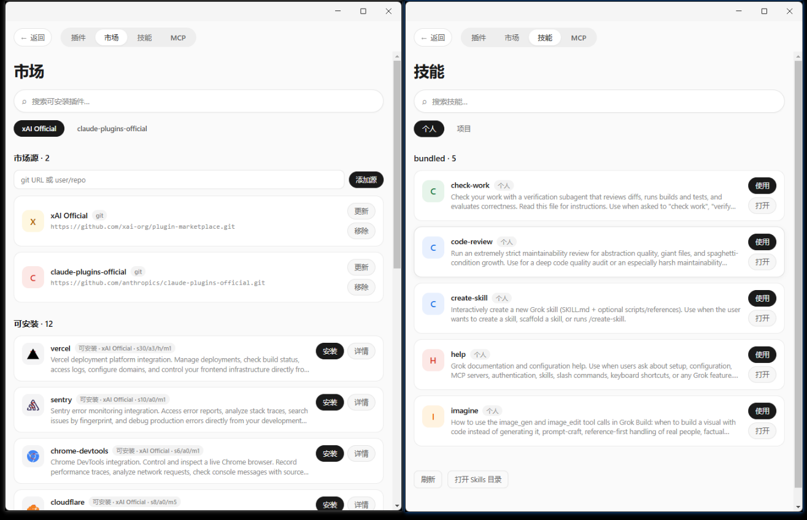
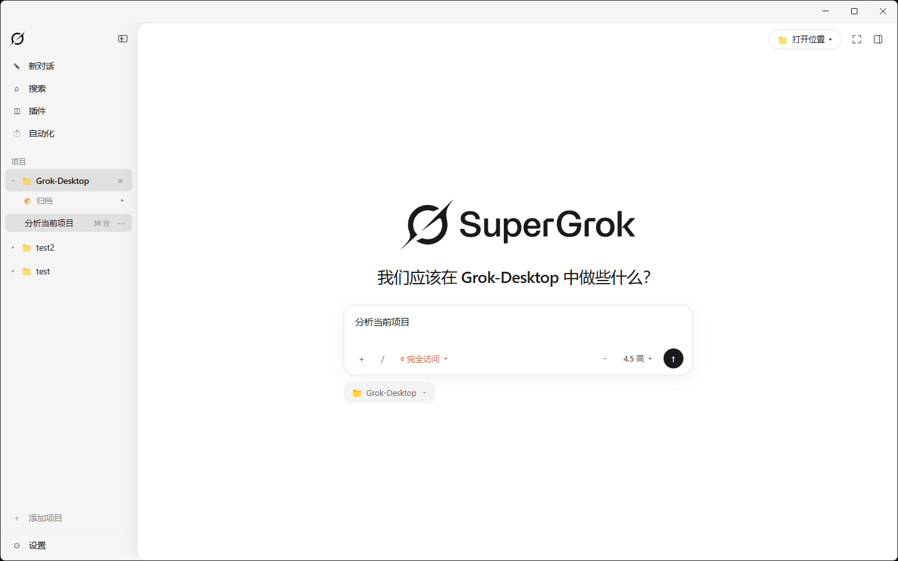

# Grok Desktop

<p align="center">
  
</p>

<p align="center">
  <strong>Grok Build 桌面工作台</strong><br />
  <b>操作体验对齐 Codex</b> · 自定义供应商 / 中转 · 多项目会话
</p>

<p align="center">
  <a href="./README_EN.md">English</a> ·
  <a href="https://github.com/fanghui-li/Grok-Desktop/releases">下载</a> ·
  <a href="./docs/README.md">文档</a>
</p>

<p align="center">
  
  
  
  
</p>

---

**Grok Desktop** 把 Grok agent 放进图形界面。布局与交互 **对标 OpenAI Codex 桌面端**；智能仍由 Grok agent 执行。

### 主工作台

<p align="center">
  
</p>

### 自定义供应商

设置 → 账户与提供商：官方登录与 **OpenAI 兼容中转** 双通道。

<p align="center">
  
</p>

| | |
|--|--|
| 配置 | 名称、Base URL、API Key、协议、模型 |
| 体验 | 拉取模型列表；多供应商；设默认；对话 chip 切换 |
| 安全 | 与 OAuth **隔离**；中转自带 Key；Key **不明文回显** |
| 数据 | `~/.grok-desktop`（与 CLI `~/.grok` 隔离） |

### 计划模式 · 插件 · 欢迎页

| 计划模式 | 插件 |
|:---:|:---:|
|  |  |

<p align="center">
  
</p>

## 其他亮点

- **像 Codex 一样用**：三栏工作台、过程块、权限条、模型/推理 chip  
- **计划 / 目标模式**：chip 切换，状态始终可见  
- **多项目 / 多会话**：侧栏切换、搜索、归档  
- **输入习惯接近**：`@` 文件、附件、`/` 命令、Skills  
- **安装即用**：Windows 包可内置 agent  

## 诚邀一起维护

项目还在 **0.1**，缺口不少、也欢迎打补丁。  
我们用一份 **[CLI ↔ Desktop 能力矩阵](./docs/cli-desktop-capability-matrix.md)** 对照 Grok CLI：哪些已对齐、哪些半成品、哪些故意 Desktop 化。

| 你可以怎么参与 | |
|----------------|--|
| 改矩阵 | 发现状态过时 → 直接改表并发 PR |
| 认领缺口 | 表里 🟡 / ❌ 都是待办线索 |
| 提体验 | [Issue](https://github.com/fanghui-li/Grok-Desktop/issues) 写清复现即可 |
| 读约定 | [CONTRIBUTING](./CONTRIBUTING.md) |

**不要求一次做完。** 修一小块、改一行状态，都超欢迎。

## 语言

**仅界面 UI** 支持中英切换（导航、设置、按钮、菜单等）；Agent 回复与工具日志不翻译。  
**设置 → 常规 → 界面语言**：跟随系统 / 简体中文 / English。

## 快速开始

1. [Releases](https://github.com/fanghui-li/Grok-Desktop/releases) 下载 `Grok Desktop-*-win-x64.exe`  
2. **设置 → 账户与提供商**（官方登录 **或** 自定义中转）  
3. 添加项目，开始对话  

```bash
npm install && npm run sync:agent && npm start
```

## 更多

[能力矩阵](./docs/cli-desktop-capability-matrix.md) · [打包](./docs/packaging.md) · [贡献](./CONTRIBUTING.md) · [安全](./SECURITY.md) · [架构](./docs/架构与协议.md)

[Apache-2.0](./LICENSE) · © 2026 [leofanghui](https://github.com/fanghui-li)
